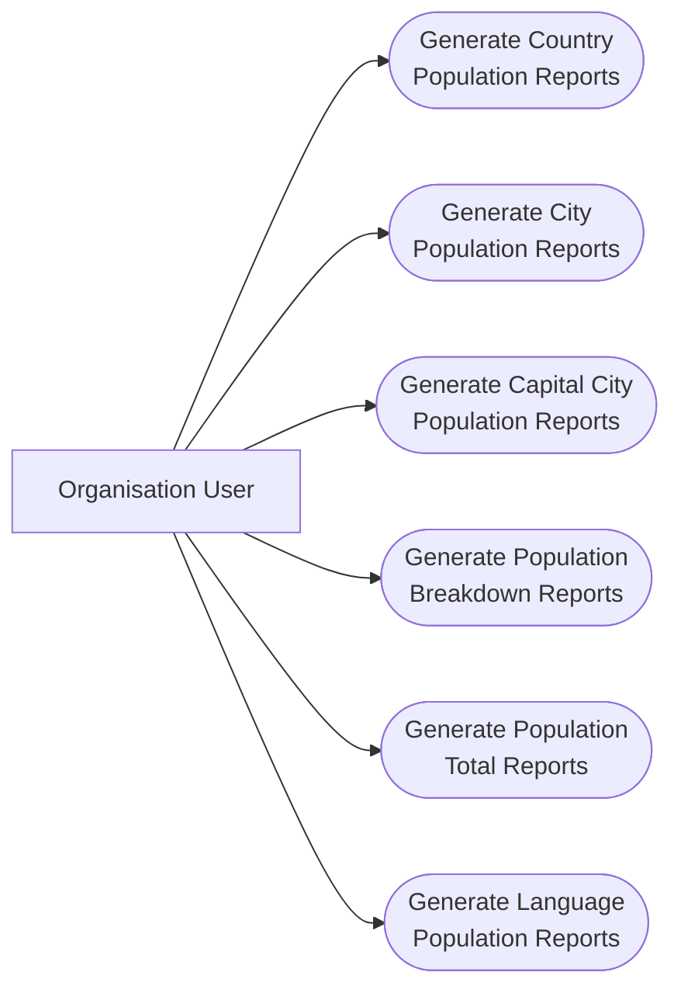

# Population Reporting System — Use Case Diagram

## Actors

**Organisation User** — The user who interacts with the population reporting system to generate and view population reports.

## Use Cases

- **Generate Country Population Reports** — Generate country population reports for the world, continent, or region.
- **Generate City Population Reports** — Generate city population reports for the world, continent, region, country, or district.
- **Generate Capital City Population Reports** — Generate capital city population reports for the world, continent, or region.
- **Generate Population Breakdown Reports** — Compare populations living in cities and outside cities.
- **Generate Population Total Reports** — View population totals for the world, continent, region, country, district, or city.
- **Generate Language Population Reports** — Compare the number and percentage of people speaking Chinese, English, Hindi, Spanish, and Arabic.
